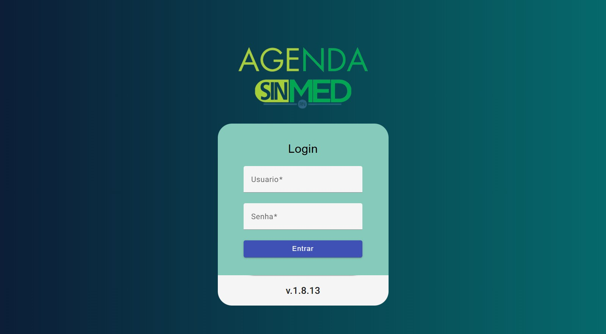
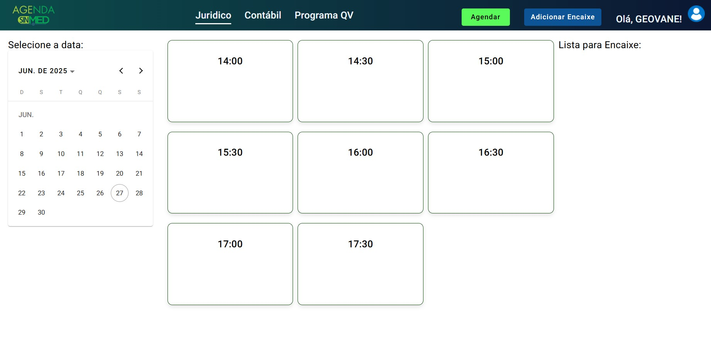

# 📅 Agenda SINMEDRN – Sistema de Agendamento Jurídico

## Tela de Login


Este repositório apresenta o **Agenda SINMEDRN**, uma aplicação web desenvolvida para auxiliar os membros do **Sindicato dos Médicos do Rio Grande do Norte (SINMEDRN)** no agendamento de horários com o Setor Jurídico.

Este repositório está disponível **exclusivamente para fins de demonstração profissional**, com o objetivo de apresentar minhas práticas de desenvolvimento full stack para **entrevistadores, analistas e recrutadores**.

## 📌 Propósito do Repositório

O **Agenda SINMEDRN** oferece uma solução prática e intuitiva para o agendamento jurídico dos associados. Este repositório demonstra:

- Técnicas de desenvolvimento front-end com Angular
- Integração com Firebase para autenticação e banco de dados em tempo real
- Organização de código para projetos escaláveis
- Boas práticas de segurança e controle de acesso

## ⚙️ Tecnologias Utilizadas

- **Angular** – Framework principal para o frontend
- **TypeScript**
- **HTML5 / SCSS**
- **Firebase** – Autenticação e hospedagem
- **Firebase Realtime Database** – Para armazenamento seguro de agendamentos
- **Angular Material** – Componentes UI

## 🧠 Funcionalidades Principais

- **✅ Agendamento de Horários:** Usuários podem marcar horários específicos para consultas ou atendimentos jurídicos.
- **📅 Visualização de Disponibilidade:** Visualização clara de dias e horários disponíveis.
- **🔒 Autenticação Segura:** Sistema de login para acesso restrito a membros autorizados.
- **📋 Gestão de Agendamentos:** Visualização, gerenciamento e cancelamento de agendamentos.

## Tela Principal



## 📁 Estrutura do Projeto

```
src/
├── app/
│ ├── components/
│ ├── pages/
│ ├── services/
│ ├── shared/
│ └── app.module.ts
├── assets/
│ └── images/
├── environments/
└── index.html
```

## 🔗 Deploy

O acesso à aplicação online é restrito aos funcionários e advogados do SINMEDRN. Esse repositório foi criado apenas para fins de demostração.

## ⚠️ Aviso
Este repositório é apenas para fins demonstrativos. Nenhuma informação sensível dos usuários ou credenciais privadas estão incluídas.

## 👨‍💻 Sobre o Desenvolvedor
Projeto desenvolvido por Geovane Silva, freelancer e desenvolvedor web com foco em soluções digitais.

Entre em contato:
📧 geovanesilva.hr@gmail.com
🔗 [LinkedIn](https://www.linkedin.com/in/geovanesilvahr/)